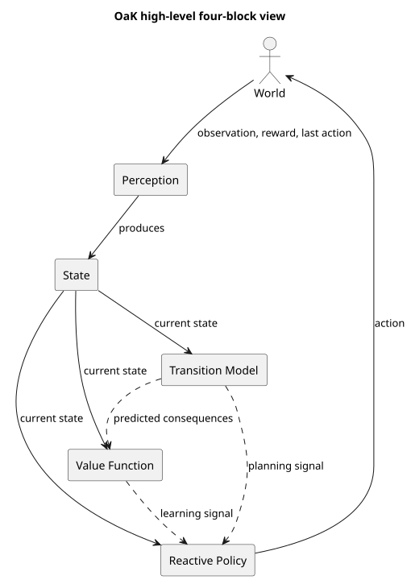

# OaK Architecture

This repository now contains a source-grounded interface proposal for Rich Sutton's OaK architecture, based on the materials in [`ressources/`](./ressources) and a comparison of the two AI-generated deep research reports.

The architecture is now presented at two levels of detail:

- a high-level OaK view with the four primary blocks: `Perception`, `ReactivePolicy`, `ValueFunction`, and `TransitionModel`
- `Perception` produces the `State` used by the other three blocks
- a more detailed OaK view showing FC-STOMP, planning, utility assessment, curation, and the option keyboard as internal OaK mechanisms

The convergence decision is simple:

- Keep the ChatGPT report's source discipline, modular decomposition, FC-STOMP pipeline, GVF framing, and utility-driven curation loop.
- Keep the Gemini report's practical focus on prototype milestones, evaluation, online normalization, and the need for pragmatic shortcuts.
- Do not bake deep-network choices, average-reward-only assumptions, or long-range intelligence-amplification claims into the core API.

Key files:

- [Comparison and convergence note](./docs/oak-convergence.md)
- [High-level Mermaid diagram](./docs/diagrams/oak_core_marmaid.mmd)
- [Mermaid architecture diagram](./docs/diagrams/oak_architecture_marmaid.mmd)
- [High-level PlantUML diagram](./docs/diagrams/oak_core.puml)
- [PlantUML component diagram](./docs/diagrams/oak_architecture.puml)
- [PlantUML runtime sequence](./docs/diagrams/oak_runtime_sequence.puml)
- [Core interfaces](./src/oak_architecture/interfaces.py)
- [Reference agent wiring](./src/oak_architecture/agent.py)
- [Shared datatypes](./src/oak_architecture/types.py)

The resulting package is intentionally interface-first. It keeps Sutton's original block names visible, uses `State` in the runnable example, and captures finer-grained OaK mechanisms without obscuring the four-block agent view.

## Environment

If you don't have `pixi` installed, you can install it following the instructions [here](https://pixi.prefix.dev/latest/installation/).

If you're on Linux/MacOS, you can use:
```bash
curl -fsSL https://pixi.sh/install.sh | sh
# or 
wget -qO- https://pixi.sh/install.sh | sh
```

## Generate the diagrams

Use the `pixi` tasks if you want all of the SVGs regenerated:

```bash
pixi run render_diagrams
```

## Minimal runnable implementation

There is now a bare-minimum concrete implementation of the interface in:

- [src/oak_architecture/implementations/minimal_oak.py](./src/oak_architecture/implementations/minimal_oak.py)
- [tst/run_minimal_oak.py](./tst/run_minimal_oak.py)

Run it with:

```bash
pixi run test
```

This test imports the implementation through the package namespace
`oak_architecture.implementations.minimal_oak`, then performs a short
end-to-end run and a few explicit runtime checks.

This smoke implementation is intentionally trivial:

- it runs the full `OaKAgent` wiring end to end
- it creates a toy `World`
- it instantiates every required interface needed by `OaKAgent`
- it does not do meaningful learning, planning, or curation

Its purpose is to test that the interface is implementable and to make the remaining real work explicit.

## Packaging and API docs

The repository is now structured to be buildable as a Python package. Useful tasks:

```bash
pixi run build_package
pixi run docs_api
```

The API docs task generates documentation from docstrings into `site/api/`.

## Rendered diagrams

### High-level Mermaid four-block view



### Detailed Mermaid OaK view


### High-level PlantUML four-block view



### Detailed PlantUML OaK view


### PlantUML runtime sequence


