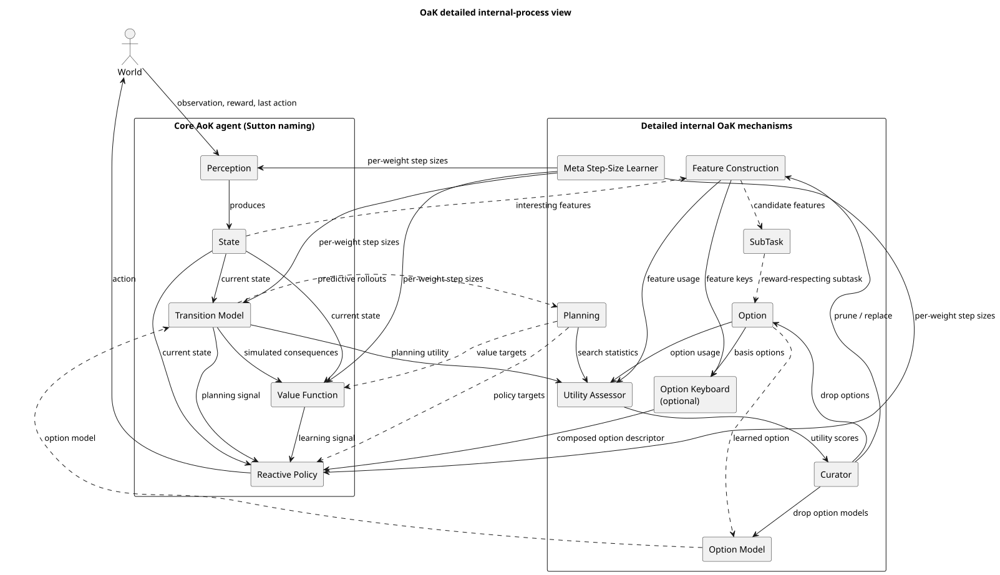
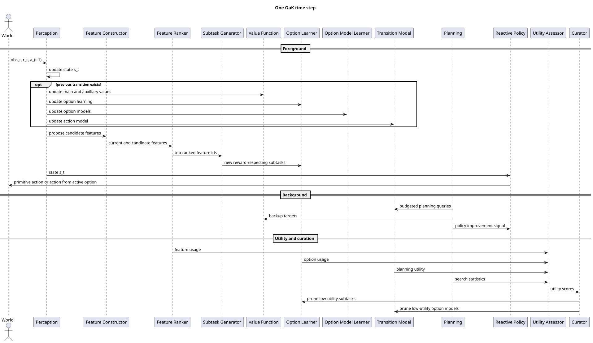

# OaK architecture convergence note

## Scope

This note compares the two AI-generated reports in [`ressources/chatgpt-deep-research-report-1.md`](../ressources/chatgpt-deep-research-report-1.md) and [`ressources/gemini-deep-research-report-1.md`](../ressources/gemini-deep-research-report-1.md), then turns that comparison into a single interface proposal for this repository.

The comparison was also checked against the local primary materials:

- [`ressources/The Alberta Plan for AI Research-1.pdf`](../ressources/The%20Alberta%20Plan%20for%20AI%20Research-1.pdf)
- [`ressources/Oak_Notes.pdf`](../ressources/Oak_Notes.pdf)
- [`ressources/Proposal_OaK_Project.pdf`](../ressources/Proposal_OaK_Project.pdf)

## Short verdict

The ChatGPT report is the stronger architectural document. It stays closer to Sutton's public wording, separates the base agent from the OaK extensions, and makes the important pieces explicit: reward-respecting subtasks, GVFs, FC-STOMP, utility-based curation, per-weight meta step sizes, and the option keyboard as an extension rather than a mandatory runtime path.

The Gemini report is the stronger project-planning document. It does a better job connecting the architecture to the course proposal, prototype milestones, evaluation ideas, online normalization, and the practical need to choose shortcuts where the literature is still incomplete.

The best solution is therefore not to pick one report wholesale. It is to keep the ChatGPT report as the architectural spine and fold in the Gemini report's implementation pragmatism where Sutton's sources leave room for engineering choice.

## Where the reports differ

### 1. Architectural faithfulness vs implementation opinion

The ChatGPT report mostly treats OaK as a systems blueprint:

- base agent: perception, reactive policy, value functions, transition model, planner
- OaK extensions: feature construction, ranking, subtask generation, option learning, option modeling, utility assessment, curation
- explicit support for reward-respecting subtasks and GVF-based interfaces
- explicit support for option keyboard and per-weight meta step sizes without forcing a concrete algorithm

The Gemini report is more opinionated:

- it leans into CNN and LLM examples very early
- it strongly pushes average-reward continuing control as the main implementation mode
- it frames some engineering choices as if they were part of the architecture itself

Decision:

- keep the ChatGPT report's component boundaries
- keep the Gemini report's engineering suggestions only as optional prototype choices

### 2. Generic contracts vs strong assumptions about learning objectives

The Gemini report argues that a faithful implementation should center average-reward control, convert episodic tasks into continuing ones, and design the value system around differential return.

That emphasis is valuable, and it is consistent with the Alberta Plan's focus on continuing problems. But it is still too strong for the core interface:

- the course project asks for a faithful interface plus a prototype, not a final doctrinal commitment
- Sutton's architecture needs to support experimentation while several pieces are still open research problems
- a useful repository should allow both discounted and continuing implementations behind the same interface

Decision:

- keep continuing and average-reward formulations as a recommended prototype mode
- do not force average reward into every method signature
- use generic GVF and transition-model contracts so both discounted and continuing variants fit

### 3. Core architecture vs speculative future layers

The Gemini report spends more time on IA, exo-cerebellum, exo-cortex, cross-domain transfer, and broad future impact claims.

Those ideas are part of Sutton's long-range roadmap, but they are not the right level for the first repository interface. They add vision, not immediate contracts.

Decision:

- document those ideas as future work
- do not let them shape the first package layout or method signatures

### 4. Source discipline

The ChatGPT report is more careful about distinguishing what is explicit in Sutton's talks and the Alberta Plan from what is inferred. That matters here because the repository's main deliverable is an interface that should remain defensible even if the implementation is incomplete.

Decision:

- favor the ChatGPT report whenever a design choice is about faithfulness to the public OaK description
- favor the Gemini report when the choice is about milestone planning, prototype evaluation, or practical shortcuts

## What to keep from each report

### Keep from the ChatGPT report

- The base-agent decomposition: `Perception`, `ReactivePolicy`, `ValueFunctionBank`, `TransitionModel`, `Planner`.
- The FC-STOMP pipeline as first-class structure instead of an informal comment.
- Reward-respecting subtasks represented explicitly rather than hidden inside the option learner.
- GVFs as the right abstraction for auxiliary predictions and subtask definitions.
- Utility accounting and curation as separate interfaces.
- Per-weight meta step sizes as an explicit contract, not just an optimizer detail.
- The option keyboard as an optional extension.
- Framework-agnostic interfaces that do not assume PyTorch, JAX, CNNs, or LLMs.

### Keep from the Gemini report

- The explicit tie to the course deliverables in the proposal.
- The emphasis on practical shortcuts where OaK is still underspecified.
- Online normalization as a realistic concern inside `Perception`.
- The importance of scoring and benchmarking, including planning usefulness and abstraction churn.
- The suggestion to compare against a simpler tabular or linear baseline, not only deep models.
- The warning that deep models will need continual-learning machinery rather than standard static training assumptions.

## What not to keep in the core interface

- Mandatory CNN-based perception.
- Mandatory LLM-based perception.
- Mandatory conversion of every environment into a continuing task.
- Mandatory average-reward-only signatures.
- Mandatory option-keyboard execution in the reference runtime.
- IA and exo-cortex concepts as first-package abstractions.

## Converged architecture for this repository

The implementation in `src/oak_architecture` follows these decisions:

- `types.py` defines the shared objects needed by the architecture: transitions, GVF specs, subtask specs, option descriptors, model predictions, planning updates, utility records, and curation decisions.
- `interfaces.py` defines the contracts for the base agent plus the OaK extensions.
- `agent.py` provides a reference wiring skeleton showing a single temporally uniform step, including perception update, value/model/option updates, feature proposal, subtask generation, budgeted planning, action selection, utility observation, and curation.

The main structural choices are:

- Keep a clean split between the base agent and the OaK abstraction machinery.
- Treat feature construction, subtask generation, option learning, and option-model learning as separate replaceable modules.
- Keep `MetaStepSizeLearner` explicit because Sutton singles out per-weight online meta-learning as a defining feature.
- Keep `OptionKeyboard` explicit but optional.
- Keep the runtime generic enough that a tabular, linear, or deep implementation can sit behind the same contracts.

## Rendered diagrams

### Mermaid architecture overview

### PlantUML component view

### PlantUML runtime sequence

## Prototype shortcuts that are reasonable today

The repository should not pretend that every part of OaK is solved. The following shortcuts are reasonable and consistent with the project brief:

- Start with a tabular or linear toy problem before deep perception.
- Let `Perception` be simple for the first prototype, but keep hooks for online normalization and continual feature growth.
- Let `Planner` be budgeted and incremental rather than complete.
- Let utility-based curation start from simple hand-designed heuristics before more ambitious learned utility estimators.
- Keep the option keyboard as an interface placeholder until the rest of FC-STOMP is functioning.

## Recommended next implementation order

If this repository is extended beyond interfaces, the order that best matches both reports is:

1. Build a toy world with a simple tabular or linear OaK-compatible agent.
2. Validate that the `OaKAgent` step loop supports convergent training.
3. Add feature ranking and basic reward-respecting subtasks.
4. Add options and option models.
5. Add utility-driven pruning.
6. Add a stronger deep-learning perception module only after the interface is already stable.

That sequence preserves the strongest part of the ChatGPT report, namely architectural discipline, while keeping the Gemini report's practical concern for milestone delivery.
